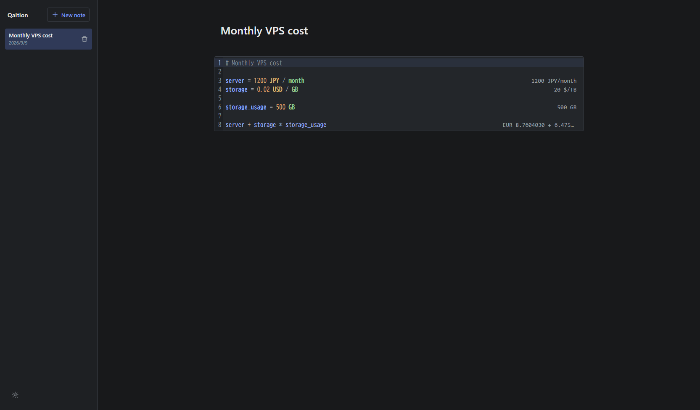

# Qaltion

> [!NOTE]
> Qaltion is experimental software and may change without notice.

Qaltion is a local-first, plain-text calculation notebook powered by [libqalculate](https://qalculate.github.io/).



<p align="center">
  <a href="https://qaltion.drsz.org/"><strong>Open Qaltion</strong></a>
</p>

## Features

- Live calculations with variables, functions, units, conversions, and currencies
- Multiple notes with automatic local saving
- Plain-text content kept separate from results and diagnostics
- Light and dark themes on desktop and mobile

## Usage

Enter one expression per line. Later lines can use variables defined above them.

```text
# Monthly VPS cost

server = 1200 JPY / month
storage = 0.02 USD / GB
storage_usage = 500 GB

server + storage * storage_usage
```

Empty lines are ignored. A `#` starts a comment, including at the end of an expression.

## Data storage and limitations

- Notes are stored only in the current browser's IndexedDB. They are not sent to a server.
- Qaltion does not currently provide accounts, synchronization, import, or export. Clearing site data deletes the stored notes, and notes do not carry over to another browser or device.
- Currency calculations use the exchange-rate snapshot bundled with the application. Rates are not refreshed in the browser.

## Development

Node.js 24 is recommended.

```sh
npm ci
npm run dev
```

Without generated WASM files, the development server uses a limited mathjs fallback. To run with libqalculate, install and activate the Emscripten SDK, then build the WASM module before starting the server:

```sh
npm run build:wasm
npm run dev
```

Run the checks and create a production build with:

```sh
npm test
npm run build
npm run preview
```

The generated application currently expects to be served from the root of a domain.

## License

Qaltion is licensed under GPL-3.0-or-later. See [LICENSE](LICENSE).

The bundled libqalculate v5.12.0 is licensed under GPL-2.0-or-later. Distributions that include the generated WASM must comply with the applicable GPL source-distribution requirements.
